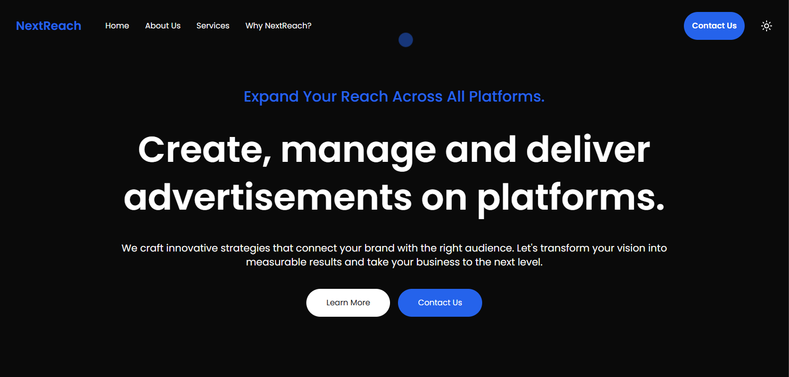
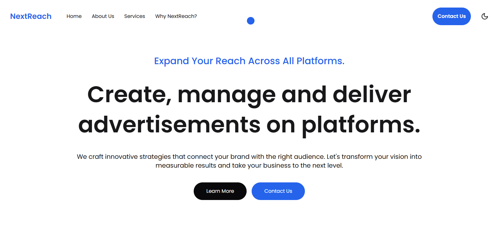

# **🚀 Marketing Pro - Landing Page**

This project is a modern, fully **responsive** landing page for a fictional marketing company, built with **Next.js** for fast performance and optimized **server-side rendering**. The design leverages **Tailwind CSS** and Flexbox to create a clean, structured, and adaptive layout that seamlessly adjusts to various screen sizes.

The landing page features a **dark/light mode toggle**, allowing users to customize their browsing experience. It also incorporates AOS (Animate On Scroll) to deliver smooth, visually engaging scroll animations. Following best practices in **UI/UX design**, the page is designed for intuitive navigation, user engagement, and an appealing aesthetic that reflects professionalism and innovation.

# **🛠️ Main Features**
- **Next.js for performance and server-side rendering**
- **Tailwind CSS for styling and Flexbox for responsive layout**
- **AOS Library for scroll animations**
- **Dark/Light Mode for theme customization**
- **Responsive Design for all devices**
- **UI/UX Design Best Practices for usability and visual appeal**
- **Personalized Cursor**

# **📷 Screenshots**
  

